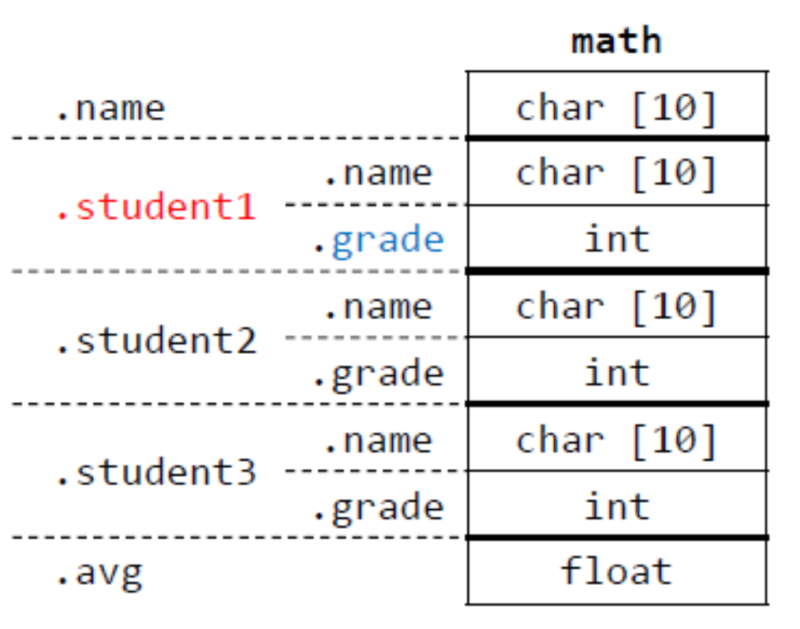

# 사용자 정의형 - 구조체
## 목차
1. [구조체](#구조체)<br>
    - [구조체 태그가 없는 경우](#구조체-태그가-없는-경우)<br>
    - [typedef](#typedef)<br>
    - [구조체 초기화](#구조체-초기화)<br>
    - [복합 리터럴](#복합-리터럴)<br>
    - [구조체의 구조체](#구조체의-구조체)<br>
    - [구조체 포인터](#구조체-포인터)
    - [멤버 접근 연산자](#멤버-접근-연산자)<br>
    - [구조체 배열](#구조체-배열)
    - [구조체와 함수](#구조체와-함수)

***
## 구조체
- 서로 다른 형의 변수들을 하나로 묶어주는 방법 제공
***
- ex 선언)
```C
struct name_grade{
    char name[10];
    int grade;
};
```
struct : 구조체를 선언하기 위한 키워드<br>
name_grade : 구조체 태그 이름<br>
name, grade : 구조체 멤버

- 참고)

***
- ex 사용 방법)
```C
struct name_grade st_g1, st_g2;     // 변수 선언
st_g1 = st_g2;      // 복사

strcpy(st_g1.name, "이순신");       // 변수 멤버 접근, char형
st_g1.grade = 80;   // int형

// 선언과 동시에 변수 선언
struct name_grade{
    ...위 구조체와 동일
}st_g3;
```
- 구조체가 main함수 밖에서 선언되면 다른 함수에서도 사용 가능
***
## 구조체 태그가 없는 경우
```C
struct{
    char name[10];
    int grade;
}st_g5;

struct{
    char name[10];
    int grade;
}st_g6;

st_g5 = st_g6;      // 오류
```
- 구조체 태그가 없는 경우 st_g5와 st_g6는 다른 형으로 간주하여 오류가 남

***
## typedef
- 구조체 형 이름은 대부분 길기 때문에 사용함
***
- ex 1)
```C
typedef struct name_grade ng;

ng st_g7;       // == name_grade st_g7;
```
- typedef를 통해 name_grade 대신 ng를 사용할 수 있게 됨
<br>
- ex 2)
```C
typedef struct name_grade{
    char name[10];
    int grade;
} ng;
```
- 위와 같이도 사용 가능

***
## 구조체 초기화
- 배열과 유사하게 초기화
***
- case 1)
```C
// 멤버 순서대로 초기화
struct name_grade st_g10 = {
    "둘리", 80
};  

// 나머지는 \0으로 초기화
struct name_grade st_g11 = {
    "둘리"
};

// grade 멤버만 100으로 초기화 나머지는 \0
struct name_grade st_g12 = {
    .grade = 100
};
```
***
## 복합 리터럴
- 구조체 멤버의 값을 배정할 때 유용
- 캐스트를 사용하여 형을 지정 : case 1)
- 복합 리터럴 내에서 멤버 지정 가능 : case 2)
***
- case 1)
```C
st_g1 = (struct name_grade){"둘리", 99};
```
- case 2)
```C
st_g2 = (struct name_grade){
    .name = "홍길동"
};
```
***
## 구조체의 구조체
- 구조체 멤버로 구조체가 올 수 있음
```C
struct subject{
    char name[10];
    struct name_grade st1;
    struct name_grade st2;
    struct name_grade st3;
    float avg;
};

struct subject math = {
    "수학", {"둘리", 20}, {"도우너", 24}, {"또치", 40}
};

math.st1.grade = 60;  // 둘리의 점수를 20 -> 60으로 변경
```
- 참고)

***
## 구조체 포인터
- 사용 방법)
```C
struct name_grade *st_gp;
st_gp = &st_g1;

strcpy((*st_gp).name, "하니");
(*st_gp).grade = 90;        // () 괄호 없으면 오류 (연산자 우선순위)
```
***
## 멤버 접근 연산자
- -> 로 사용

- ex)
```C
strcpy(st_gp -> name, "하니");
st_gp -> grade = 14;
```
***
## 구조체 배열
- 일반 배열과 같은 방법으로 선언하고 사용
```C
struct name_grade st_a[5] = {
    {"둘리", 10}, {"도우너", 20}
    ..., {"고길동", 100}
};

// C99 부터는 다음과 같이 선언도 가능
struct name_grade st_a[5] = {
    [1] = {"둘리", 100}
};

struct name_grade st_a[5] = {
    [1].grade = 87, [1].name = "둘리"
};

```
***
## 구조체와 함수
- 함수의 인자로써 구조체가 전달될 때 값으로 전달됨 : case 1)
- 함수의 리턴형을 구조체 태그로, 함수 내에서 return 값을 구조체 변수로 사용 : case 2)
- 또는 *사용, 인자로는 구조체의 주소를 준다 : case 3)
***
- case 1)
```C
typedef struct grade{
    int grade[2];
    int sum;
    float avg;
} grade;

int grade_proc(grade st){
    st.sum = st.grade[0] + st.grade[1];
    
    st.avg = stp.sum / 2.0;
}

int main(){
    grade st = {{0}, {0}, {0}, {0}};        // 구조체 선언 및 초기화

    scanf("%d %d", &st.grade[0], &st.grade[1]);     // 점수 입력 받음

    grade_proc(st);        // 구조체를 인자로 전달
}
```
- case 2)
```C
...
//위 와 동일
...
grade grade_proc2(grade st){
    ...
    // 위 와 동일
    ...
    return st;
}

int main(){
    ...
    // 위와 동일
    ...
    st = grade_proc2(st);   // 구조체를 전달하고 리턴 받음
}
```

- case 3)
```C
int grade_proc3(grade *stp){
    stp -> sum = stp -> grade[0] + stp -> grade[1];

    stp -> avg = stp -> sum / 2.0;
}

int main(){
    ...
    // 위와 동일
    ...
    st = grade_proc2(&st);   // 구조체를 전달하고 리턴 받음
}
```
