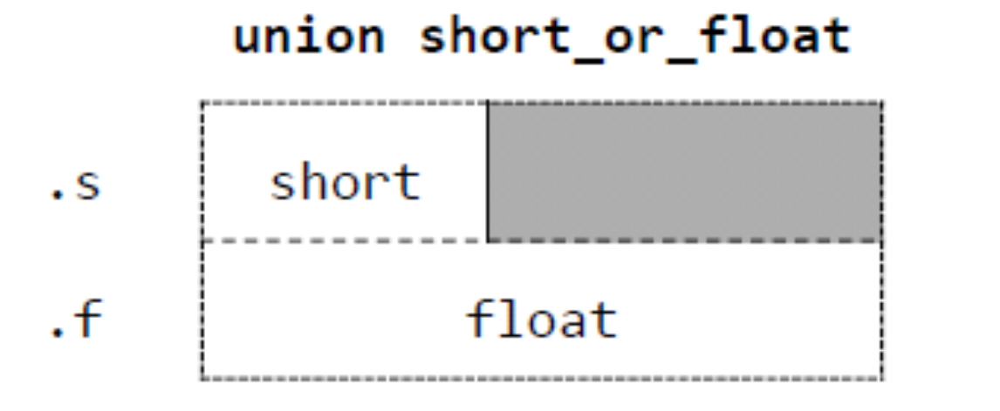

# 사용자 정의형 - 공용체, 열거형
## 목차
1. [공용체](#공용체)
    - [공용체 선언](#공용체-선언)
    - [공용체의 크기](#공용체의-크기)
    - [공용체의 사용](#공용체의-사용)
1. [열거형](#열거형)
    - [열거형 선언](#열거형-선언)
        - [열거형 변수 선언](#열거형-변수-선언)
    - [열거형의 사용](#열거형의-사용)

***
# 공용체 Union
- 공용체는 구조체와 비슷한 구문 형식을 가지지만 각 멤버들은 같은 기억장소를 공유함
- 공용체 형은 메모리의 같은 위치에 저장될 여러 값의 집합을 정의함

***
- ex)
```C
union s_f{
    short s;       
    float f;      
};
```
union : 키워드<br>
s_f :  태그<br>
s, f : 멤버

- 참고 - 공용체 구조

***
## 공용체 선언
- 공용체는 구조체와 같은 방법으로 선언, 접근함

- ex)
```C
typedef union s_f{
    short s;
    float f;
}number;

int main(){
    number n;

    n.s = 2007;
    printf("%d %e\n", n.s, n.f);        // 2007 -28582(쓰레기값)

    n.f = 2007.0;
    printf("%d %e\n", n.s, n.f);        // -2828672(쓰레기값) 2.00700000e+03
}
```
***
## 공용체의 크기
- ex)
```C
union s_f{
    short s;        // 2bytes
    float f;        // 4bytes
};         // sizeof(s_f) == 4bytes, 멤버 중 큰 자료형의 bytes값을 가짐
```
- 멤버 중 큰 자료형의 bytes값이 할당 됨
***
## 공용체의 사용
- 공용체는 구조체의 멤버로 주로 사용된다.
- 공용체를 멤버로 가진다면, 멤버를 하나 더 정의하여 현재 공용체에 어떤 멤버의 값이 저장됐는지를 표시하는 것이 좋다.

```c
#include <stdio.h>
#define WON 0
#define DOLLAR 1

union won_of_dollar{
    int won;
    float dollar;
};

struct product{
    char *name;
    _Bool w_d;
    union won_of_dollar price;
};
```
***
# 열거형 enum
- 유한 집합을 명명하고, 그 집합의 원소로써 식별자를 선언하는 수단을 제공함
- 숫자대신 단어를 사용할 수 있게 함
***
- ex)
```c
enum day{
    Sun, Mon, Tue,..., Sat
};

printf("%d\n", Sun);    // 0 출력
```
enum : 키워드<br>
day : 태그<br>
Sun, Mon : 멤버
***
## 열거형 선언
- ex)
```c
enum month{
    Jan = 1, Feb, ... , Dec
}   // Jan = 1, Feb = 2, ...

enum fruit{
    apple = 7, pear, orange = 3, lemon
};  // apple = 7, pear = 8, orange = 3, lemon = 4

enum veg{
    beet = 17, carrot = 17, corn = 17
};
```
***
### 열거형 변수 선언
```c
enum day d1, d2;

// 선언과 동시에 변수 할당 가능
enum day {
    Sun, Mon, ... , Sat
}d1, d2;

// 태그 생략시에는 선언 꼭 하기
enum {
    Sun, Mon, ... , Sat
}d1, d2;
```
***
## 열거형의 사용
- 열거형 변수는 일반 변수와 같이 사용됨

```c
d1 = Sun;
if(d1 == d2){
    ...생략
}
```

- cf) 구조체는 `a == b` 사용 불가
`a.num` == `b.num`과 같이 일일이 비교해야함
***

